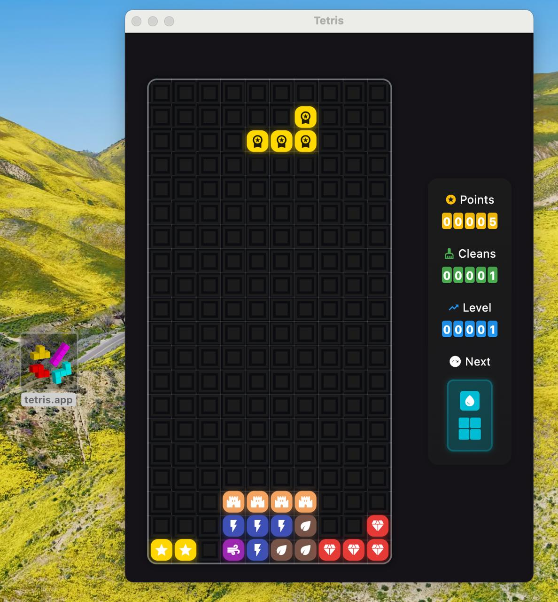

# 🎮 Tetris

Классическая игра Tetris, реализованная на Flutter для всех основных платформ.



## 📱 Поддерживаемые платформы

- **Android** - мобильные устройства и планшеты
- **iOS** - iPhone и iPad  
- **macOS** - настольные компьютеры Apple
- **Windows** - настольные компьютеры Windows
- **Linux** - настольные компьютеры Linux
- **Web** - браузеры (в разработке)

## ✨ Особенности

- 🎯 Классический геймплей Tetris
- 🎨 Современный Material Design 3 интерфейс
- 🖥️ Адаптивный дизайн для всех устройств
- ⌨️ Управление с клавиатуры (десктоп)
- 👆 Сенсорное управление (мобильные)
- 🔒 Фиксированный размер окна на десктопе
- 🌙 Темная тема по умолчанию

## 🎮 Управление

### Десктоп (клавиатура)
- **← →** - перемещение фигуры влево/вправо
- **↓** - ускоренное падение
- **↑** - поворот фигуры
- **Пробел** - мгновенное падение

### Мобильные устройства
- **Свайп влево/вправо** - перемещение фигуры
- **Свайп вниз** - ускоренное падение
- **Свайп вверх** - поворот фигуры
- **Двойной тап** - мгновенное падение

## 🏗️ Архитектура проекта

```
lib/
├── core/           # Общие компоненты
├── feature/        # Функциональные модули
│   └── game/       # Игровая логика
│       ├── domain/     # Бизнес-логика
│       ├── widgets/    # UI компоненты
│       └── game_notifier.dart  # Управление состоянием
└── main.dart       # Точка входа
```

## 📦 Сборка

### Создание релизных версий

```bash
# Android APK
flutter build apk --release

# iOS (требует Xcode)
flutter build ios --release

# macOS
flutter build macos --release

# Windows
flutter build windows --release

# Linux
flutter build linux --release
```

### Генерация иконок

После изменения иконки в `assets/icon/app_icon.png`:

```bash
flutter pub run flutter_launcher_icons:main
```

## 📄 Лицензия

WTFPL делайте что хотите)

## 🙏 Благодарности

- Flutter команде за отличную платформу
- Сообществу Flutter за поддержку и примеры

---

**Наслаждайтесь игрой! 🎯**
